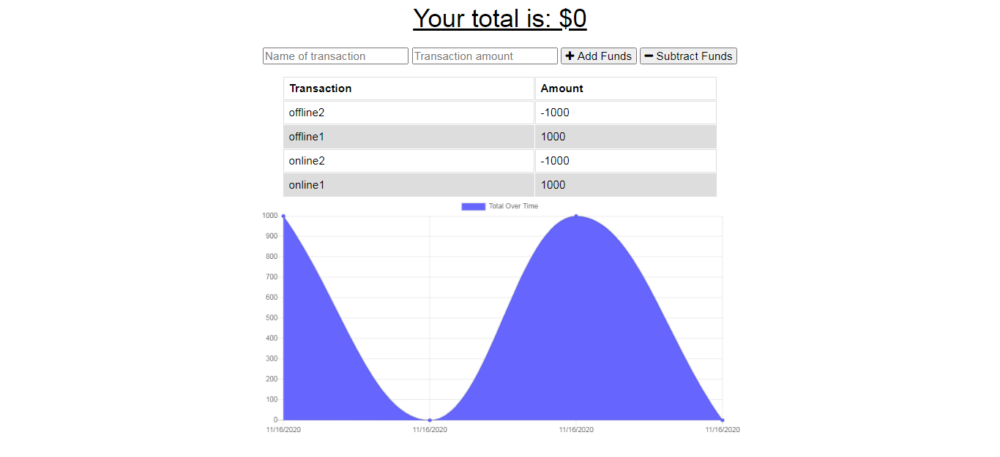

  # Employee Tracker

  
  [Link to Site](https://budget-tracker-uo.herokuapp.com/)

  ## Description
  * This application allows the user to maintain a budget through tracking spending and money earned, wether the user is online or offline!

  ## Table of Contents
  * [Installation](#installation)
  * [Usage](#usage)
  * [License](#license)
  * [Contributing](#contributing)
  
  ## Usage
  
  ## License
  * This project is licensed under: MIT

  ## Questions
  Please contact me with any questions you may have using the links below!
  * [GitHub Profile](https://github.com/haydenrust1)
  * <haydenrust1@gmail.com>
  
